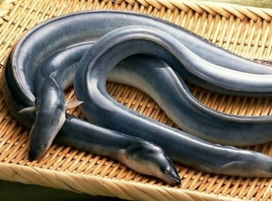
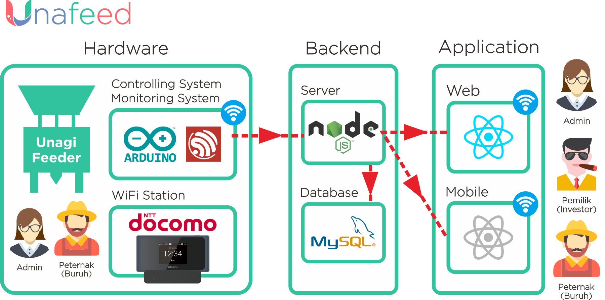
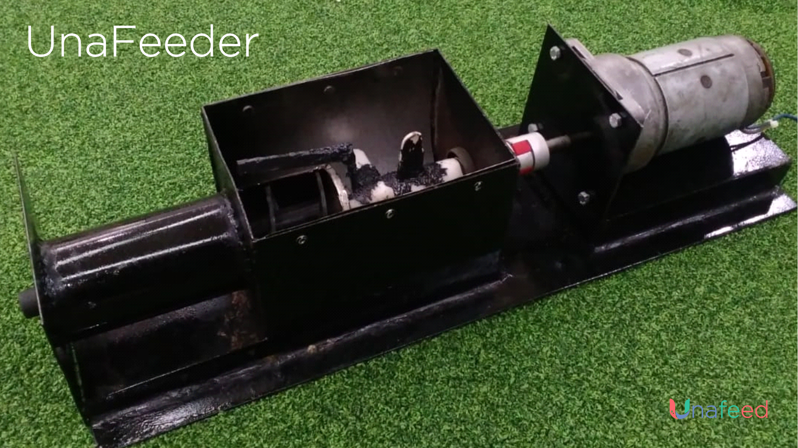
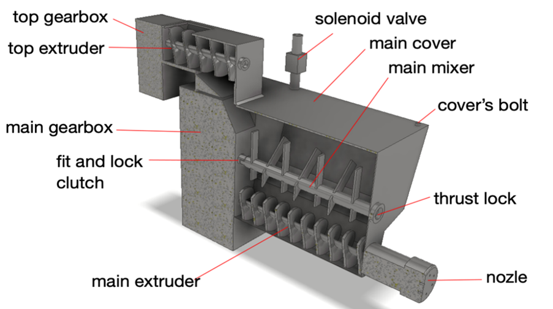

 

# Unafeed: IoT Unagi Feeder

### *__Elevator pitch__*

Small scale urban aquaculture became more prominent after Covid-19. A lot of work from home office workers creates their own pond. Yet, they only fill their small pond with low value fish commodities such as catfish. We don’t think that is worth the resource. So we fill the pond with Unagi eels (_Anguilla bicolor_). Unagi is usually served as the most expensive menu on Japanese restaurants.

Our idea seems smart, but soon we realized that feeding Unagi is too much hassle.  We must mix the feed powder with water in a precise quantity to create paste feed. There is no such kind of auto feeder available in the market. Furthermore, we are going to work from the office soon. We can’t feed the Unagi manually anymore. Thus, we create __Unafeed__, specially tailored Unagi IoT feeder.

### *__Inspiration__*

Unagi feed paste is similar with noodle dough. So we salvage some of old parts in our workshop to make a noodle maker-like as an auto feeder MVP. 
 

### *__What it does__*

It is mixing water and feed powder precisely to become well textured unagi feed paste. Its settings can be remotely controlled via apps or web. We can set how much feed and when to feed from anywhere. Thus, we can leave the pond safely to the office without risk of hungering the unagi.

### *__How we built it__*

We use the car window’s motor to turn the  blades that mix feed powder and water. The feed powder quantity is managed by a servo, the water quantity is managed by a selenoid valve. The mixture ejected by using an extruder. We use ESP32 as the microcontroller. Then we connect it to our web/apps. For backend we use Node.js with MySQL database, React.js & React Native for client web & mobile apps.

1. __Backend__: Node.js, Express.js
2. __Database__: MySQL
3. __Frontend__: React
4. __Mobile App__: React Native
5. __Hardware__: ESP32, Arduino
6. __Code Editor__: Visual Studio Code, Arduino IDE

#### Tech Stack Schema

#### Hardware

### __*Challenges*__

Unagi feed is very sticky. They stick in the blades and in the corner of the blades' chamber. Once the powder has been mixed with water, it is going to spoil within a day.  We must improve the mixing mechanism to prevent it. The servo can’t manage the amount of unagi powder very precisely. While the auto feeder is simple in software and electrical controller, it is still challenging in mechanical part.. 

### __*Accomplishment*__

We manage to achieve the basic function of an unagi auto feeder. The controller works well and it can create good unagi feed paste i. We can solve unagi feeding matters remotely with Unafeed. 

### *__What we learned__*

We learn the mechanical complexity of paste textured Unagi auto feeder. We already have a design to solve those problems. Also how to make HTTP request from the hardware, it's kind a little bit tricky.

### *__What next__*

Next time we will improve our auto feeder by putting the extruder below the blades. So, no feed mixture will stick in the mixing chamber. We also change the servo that manages the feed powder quantity with a small extruder to increase the precision. Also on the software side, we will use MQTT protocol & apply real time features.

#### Next mechanical design

  

__Unafeed for Garuda Hacks__ © 2020
